# Production Architecture (Viral Ready + Tested)

## Goal
A highly scalable, production-ready backend designed to withstand **Viral Spikes**, verified by **Unit Tests** before frontend integration.

## System Pipeline (Flow)

```mermaid
sequenceDiagram
    autonumber
    participant User as 👤 User (Telegram)
    participant Client as 📱 Frontend (React)
    participant Auth as 🔐 Auth (FastAPI)
    participant API as 🚀 API (FastAPI)
    participant Redis as 📨 JobQueue (Redis)
    participant Worker as 👷 Worker (Python)
    participant OpenAI as 🤖 OpenAI
    participant S3 as ☁️ AWS S3
    participant DB as 🗄️ Supabase

    Note over Client, DB: Phase 1: Authentication
    Client->>Auth: POST /auth/login (initData)
    Auth->>Auth: Validate HMAC Signature
    Auth-->>Client: Return JWT Token

    Note over Client, DB: Phase 2: Async Submission
    Client->>API: POST /generation (Prompt + JWT)
    API->>API: Rate Limit Check
    API->>Redis: Enqueue Job (Status: PENDING)
    API-->>Client: Return Job ID (202 Accepted)

    Note over Client, DB: Phase 3: Background Processing & Polling
    par Frontend Polling
        loop Every 1s
            Client->>API: GET /generation/{id}
            API->>Redis: Get Status
            API-->>Client: Returns Status (PENDING/PROCESSING)
        end
    and Worker Processing
        Worker->>Redis: Pop Job
        Worker->>Worker: Validation
        Worker->>OpenAI: Generate (gpt-image-1.5)
        OpenAI-->>Worker: Temp URL
        Worker->>S3: Upload Image (Permanent)
        Worker->>DB: Save Metadata
        Worker->>Redis: Update Status (COMPLETED)
    end

    Note over Client, DB: Phase 4: Delivery
    Client->>API: GET /generation/{id}
    API-->>Client: Status: COMPLETED + S3 URL
    Client->>User: Display Image
```

## Strategy: "Viral Readiness"
1.  **Rate Limiting**: Strict per-user limits (e.g., 5 generations/minute) using **Redis Cell** or Token Buckets to prevent abuse and API cost explosions.
2.  **Concurrency Control**: Semaphore-limited workers to avoid creating thousands of pending OpenAI requests.
3.  **Connection Pooling**: `SQLAlchemy` with `pgbouncer` (on Railway) or internal pooling to prevent exhausting DB connections.
4.  **Retries**: Exponential backoff for OpenAI 429s (Rate Limits).

## Verification Strategy
-   **Unit Tests (`pytest`)**:
    -   `test_auth.py`: Validate Telegram signature check and JWT issuance.
    -   `test_queue.py`: Verify Job Manager enqueue/dequeue logic (Memory/Redis).
    -   `test_worker.py`: Verify Worker flow (Mock OpenAI/S3 to ensure retries and DB updates work).
    -   `test_api.py`: Verify Endpoints return correct status codes (202 Accepted, 401 Unauthorized).

## Architecture Components

### 1. FastAPI Backend (Service A)
-   **Middleware**: `RateLimitMiddleware` (Redis-backed). Rejects excessive requests immediately (`429 Too Many Requests`).
-   **Endpoints**:
    -   `POST /api/auth/login`: Validates Telegram `initData` (HMAC-SHA256) -> Returns JWT.
    -   `POST /api/generation`: Validates JWT -> Checks Credits -> Enqueues Job (Redis) -> Returns Job ID (`202 Accepted`).
    -   `GET /api/generation/{job_id}`: Validates JWT -> Checks DB for status/result.

### 2. Background Worker (Service B)
-   **Scalability**: Can run `N` worker instances on Railway.
-   **Workflow**:
    1.  Pops Job from Redis Queue (`RPUSH`/`BLPOP`).
    2.  Calls OpenAI Model (`gpt-image-1.5`).
    3.  **Retry logic**: Uses `tenacity` for exponential backoff on network/rate errors.
    4.  Downloads generated image.
    5.  Uploads to **AWS S3** (`pixelpop` bucket).
    6.  Updates **Postgres Database** (Supabase) with `status=COMPLETED` and `public_url`.

### 3. Infrastructure
-   **Database**: Supabase (PostgreSQL). Stores User Credits and Generation Metadata.
-   **Cache/Queue**: Redis (Railway Plugin). Handles Rate Limiting counters and Job Queue.
-   **Storage**: AWS S3. Stores permanent image assets.

## Configuration Requirements
-   `OPENAI_API_KEY`
-   `TELEGRAM_BOT_TOKEN`
-   `JWT_SECRET`
-   `AWS_ACCESS_KEY_ID`, `AWS_SECRET_ACCESS_KEY`, `AWS_BUCKET_NAME` (pixelpop)
-   `DATABASE_URL`
-   `REDIS_URL`
